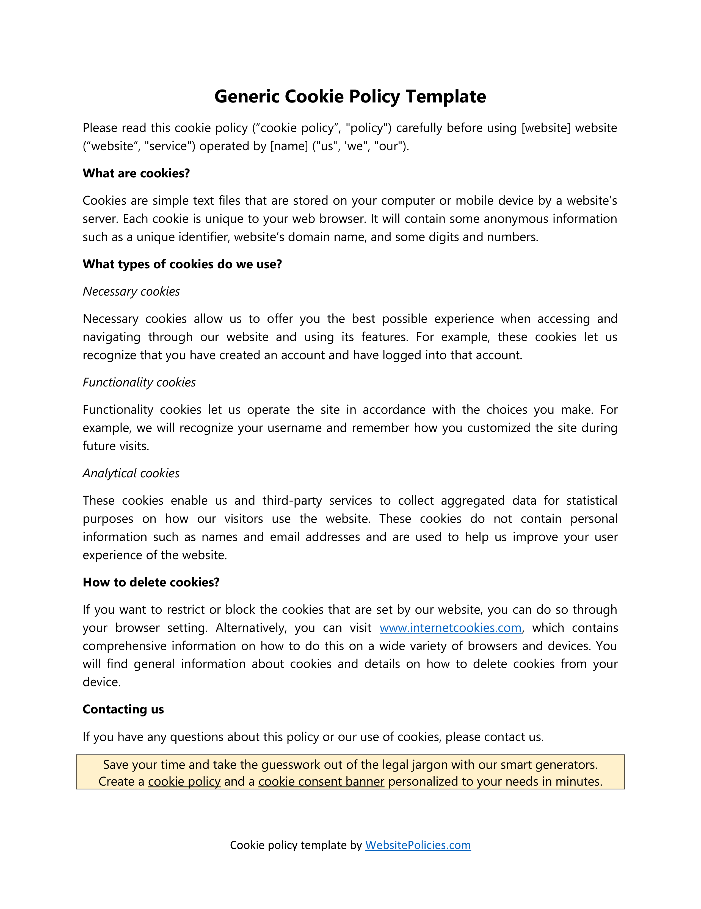
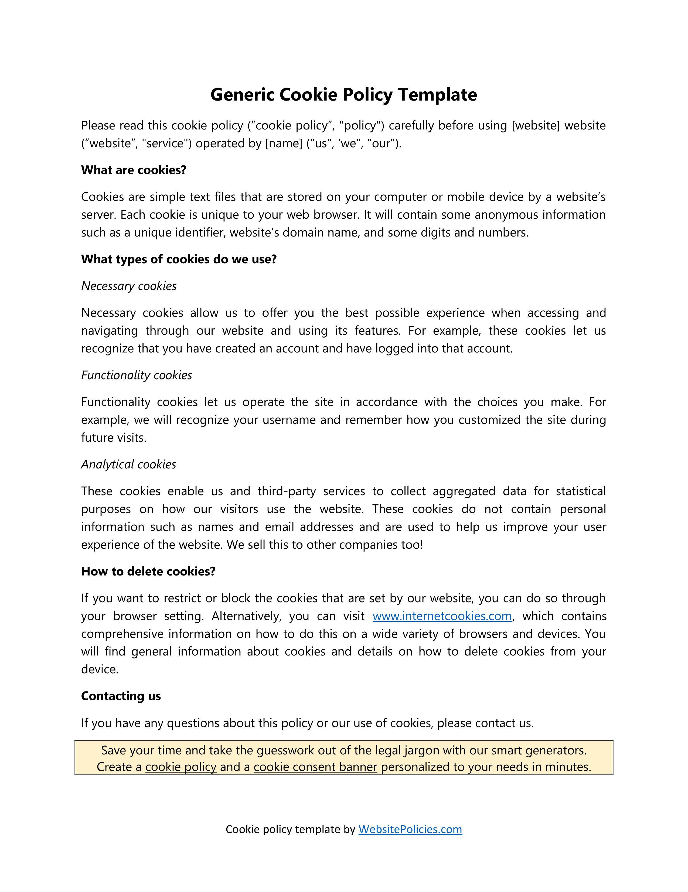
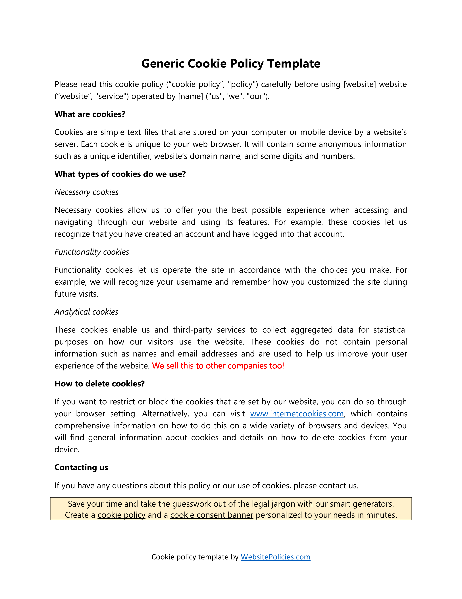
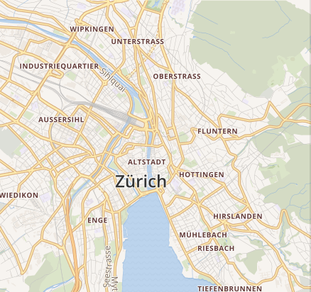
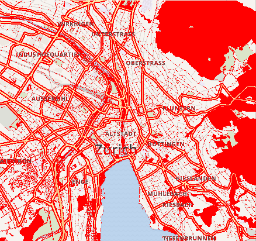

<div align="center">
    
</div>

# difftective

_difference + detective = difftective_

`difftective` is a tool for detecting visual differences in images/PDFs.

## Examples

Document looking like the same? No update history? Find visual differences with `difftective`:

_Note: There are other services which provide text diff for PDFs; `difftective`, however provides an easy way to detect changes through visual differences._

| expected | actual | diff |
| --- | --- | --- |
|  |  |  |

On a [classic Mapbox example](https://github.com/mapbox/pixelmatch):

| expected | actual | diff |
| --- | --- | --- |
|  |  |  |

## Installation

Using `go install`:

```sh
go install github.com/burntcarrot/difftective@latest
```

## Usage

```sh
$ difftective

difftective v0.1.0 - Detect differences in images and PDFs

Available commands:

   pdf     Use PDFs
   image   Use images

Flags:

      --help   Get       help for the 'difftective' command.
```

Detect differences in PDFs:

```sh
$ difftective pdf -p policy-old.pdf -n policy-new.pdf -o diff.png
Difference: 0.093%
Saved difference to diff.png
```

Detect differences in images:

```sh
$ difftective image -p examples/mapbox/mapbox1.png -n examples/mapbox/mapbox2.png -o diff.png
Difference: 38.301%
Saved difference to diff.png
```

## License

`difftective` is released under the MIT license. See [LICENSE](./LICENSE).

